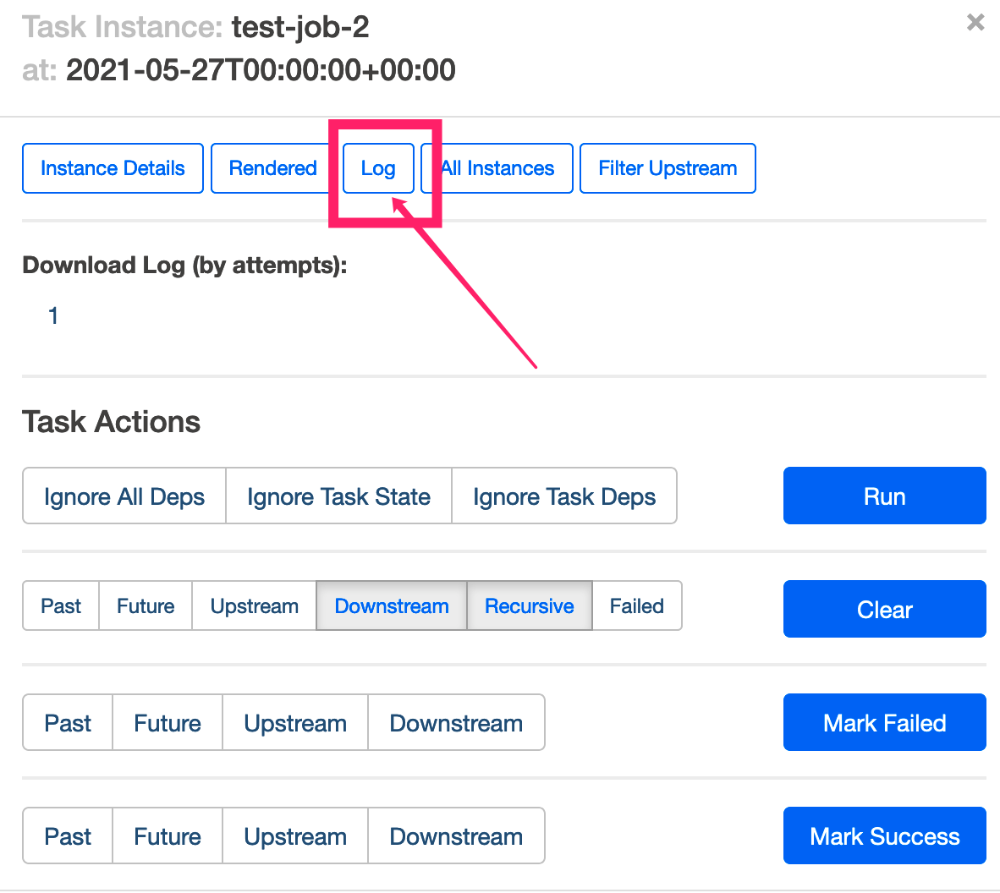
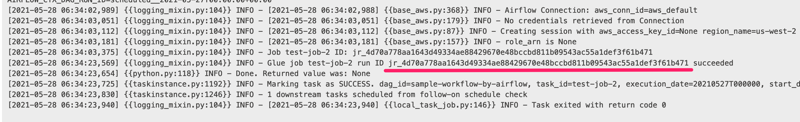

# Glue任务编排

AWS Glue是一项完全托管，无服务器架构的ETL服务。客户无需预置基础设置，仅需由Glue负责预置、扩展Spark运行环境，客户只需要专注开发ETL代码，并且使用AWS Glue时，只需为ETL作业运行时间付费。然而，当客户在考虑迁移现有ETL任务到Glue的过程中，Glue任务编排的选型上有诸多选择。本文就编排选型，如何实现自动化迁移工作流，减少开发人员适配工作上做一定的探索。

## 使用Glue Workflow编排任务

Glue原生提供Glue Workflow（Glue工作流）作为Glue ETL任务的编排服务。Glue Workflow提供可视化界面，可以方便地创建基于Glue任务的工作流，在Glue工作流中指定作业、爬虫程序（Glue Crawler)和触发器。工作流可以按需或者按指定计划运行。

然而，在迁移现有ETL工作流，尤其是复杂的ETL工作流时，在可视化界面上一一重新定义并不现实。这时候就需要有自动化手段进行迁移。和其他AWS服务类似，Glue Workflow的代码化定义有几种方式：

- Glue服务的API/SDK
- CloudFormation
- AWS CDK (Cloud Development Kit)

以常见的Azkaban工作流为例，Azkaban[可通过API导出现有工作流的JSON](https://azkaban.github.io/azkaban/docs/latest/#api-fetch-flows-of-a-project)描述文件，示例如下。

```json
[
  {
  "project" : "azkaban-test-project",
  "nodes" : [ {
    "id" : "test-final",
    "type" : "command",
    "in" : [ "test-job-3" ]
  }, {
    "id" : "test-job-start",
    "type" : "java"
  }, {
    "id" : "test-job-3",
    "type" : "java",
    "in" : [ "test-job-2" ]
  }, {
    "id" : "test-job-2",
    "type" : "java",
    "in" : [ "test-job-start" ]
  } ],
  "flow" : "sample-workflow-by-cdk",
  "projectId" : 192
  }
]
```

在上述JSON描述文件里，每个node是一个任务，而每个节点的依赖任务则定义在"in"中。针对这样的任务关联描述，我们选用AWS CDK的方式部署相应的Glue Workflow，因为使用CDK可以用代码化的方式生成CloudFormation模板，而不需要在模板里手动填写每个任务的依赖关系，从而减少开发人员的工作量。并且，当修改JSON描述文件时，比如增加或者删除一个任务依赖时，只需要更新CloudFormation堆栈，CloudFormation可以自动生成更新，将提交的更改与堆栈的当前状态进行对比，然后仅更新更改过的资源。

```bash
git clone https://github.com/yizhizoe/glue_orchestration.git
cd glue-workflow-cdk
#上传Python脚本到Glue的默认S3桶
aws s3 cp dummy.py s3://aws-glue-scripts-<account ID>-<region>/
export GLUE_SCRIPT_S3="s3://aws-glue-scripts-<account ID>-<region>/dummy.py"
cdk init
cdk deploy glue-job-cdk
cdk deploy glue-workflow-cdk
```


工作流


尝试启动工作流


当添加一个任务test-job-4，并且更改任务之间依赖。


部署任务的CDK堆栈和工作流的堆栈，注意到在只有变化的部分被更新了。在工作流界面上可以发现任务test-job-4已经被加到工作流里

```bash
cp updated_sample_workflow.json sample_workflow.json
cdk deploy glue-job-cdk
cdk deploy glue-workflow-cdk
```


几个限制

- Cloudformation单个Stack的500 resource上限
- Cloudformation单个template长度上限

## 使用Apache Airflow编排任务

（airflow介绍和MWAA介绍）

在这一节里，我们仅创建Airflow DAG做Glue任务的编排，Glue任务的定义我们沿用上一节CDK部署的Glue任务。

[按照MWAA Get Started文档创建MWAA环境](https://docs.aws.amazon.com/mwaa/latest/userguide/get-started.html)，注意以下MWAA环境使用的是最新Airflow 2.0以上的环境，在创建MWAA环境时，选择Airflow 2.0.2。之后执行以下的命令将DAG上传MWAA的S3里。

```bash
cd ../glue-airflow/
export MWAA_S3=s3://<bucket_name>
aws s3 mb $MWAA_S3
aws s3 cp requirements.txt $MWAA_S3/
aws s3 cp dags/glue_dag.py $MWAA_S3/dags/
```

给MWAA的执行角色添加Glue任务相应的权限。

```bash
POLICY_ARN=$(aws iam create-policy --policy-document file://iam_policy_example/glue-run-policy.json --policy-name glue-run-policy --query Policy.Arn)
aws iam attach-role-policy --role-name Glue-mwaa-env-role --policy-arn $POLICY_ARN
```

登录到Airflow的UI界面上可以看到sample-workflow-by-airflow的DAG，将其设置为active。在Graph view里可以看到结构和json描述文件里的任务相对应。启动DAG可以看到DAG执行成功。


虽然每个DAG中的Task instance和Glue的任务一一对应，但是如果要查找Glue任务的执行日志以及监控指标，我们需要能关联每次执行的Task Instance和Glue任务的Run ID。



Task instance的日志里记录了Glue任务的Run ID。根据这个Run ID，可以



