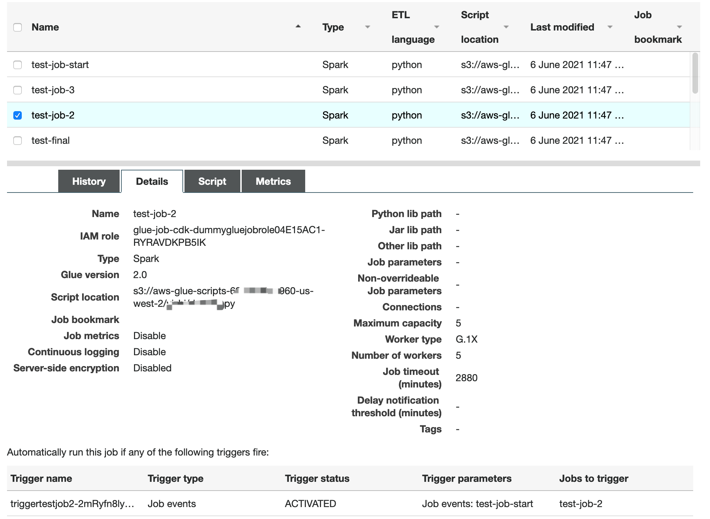
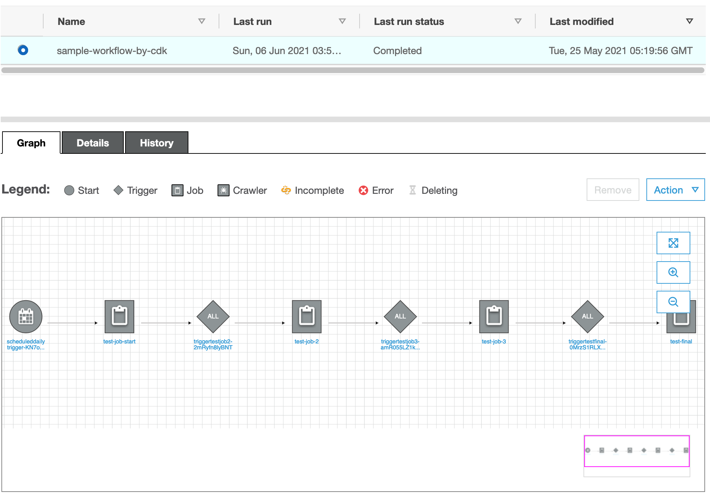
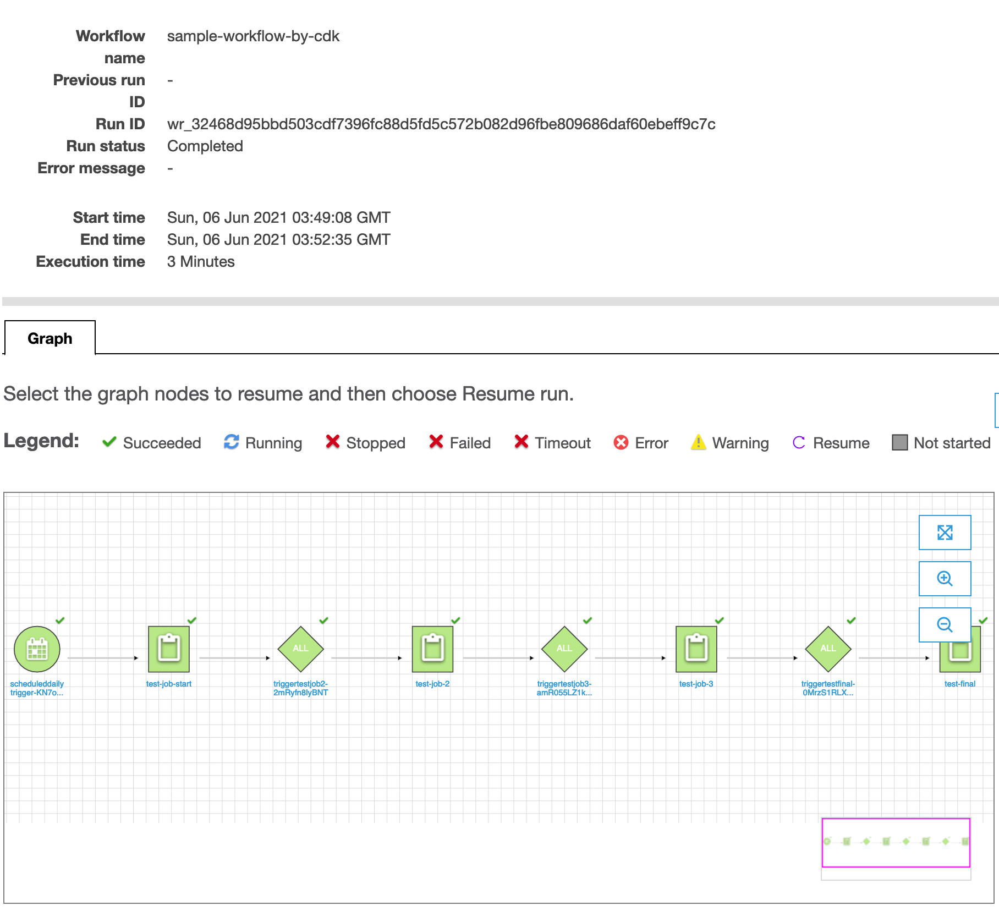
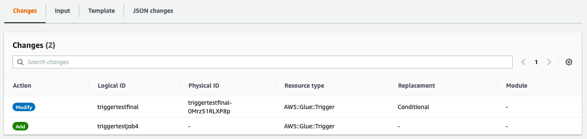
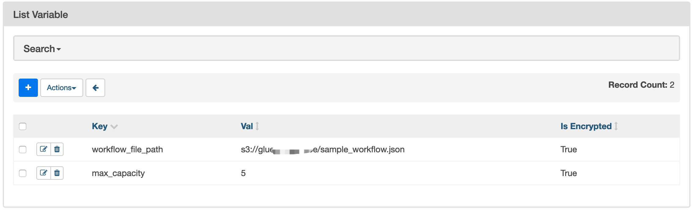
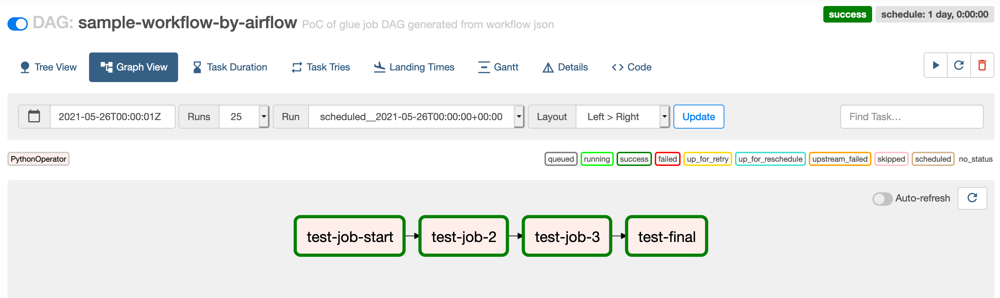
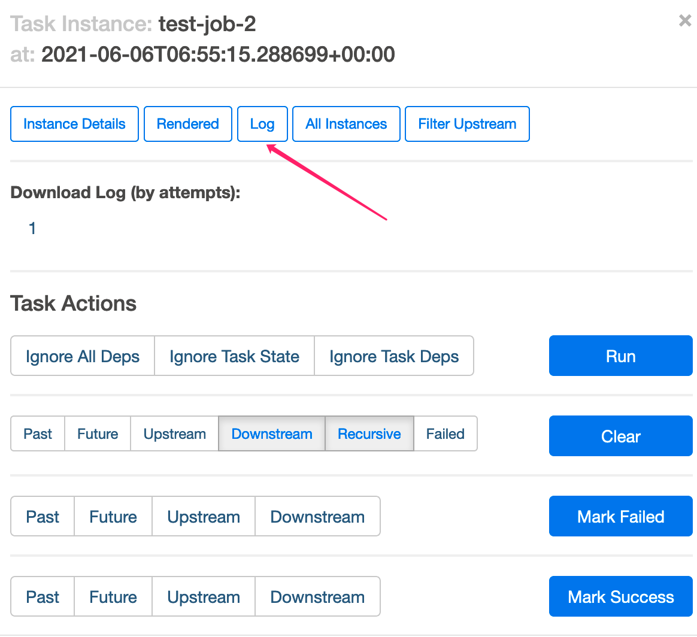
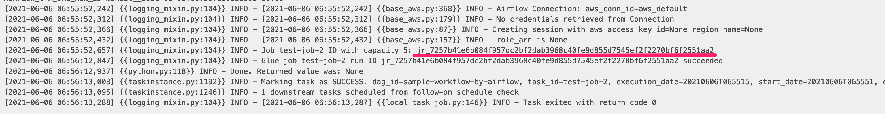
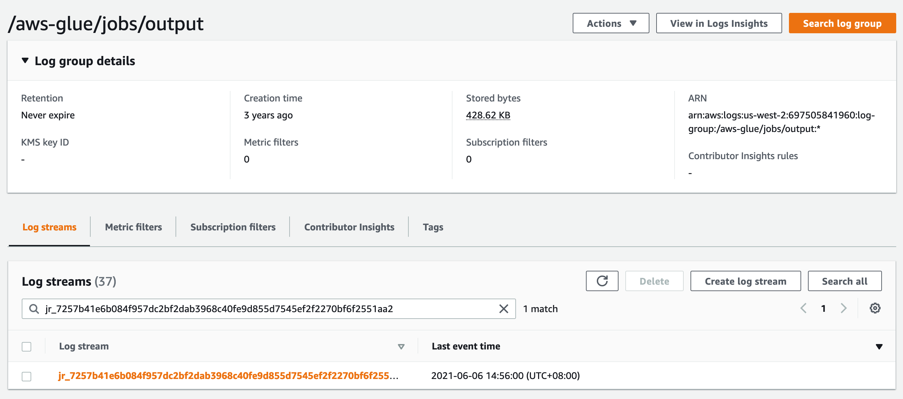
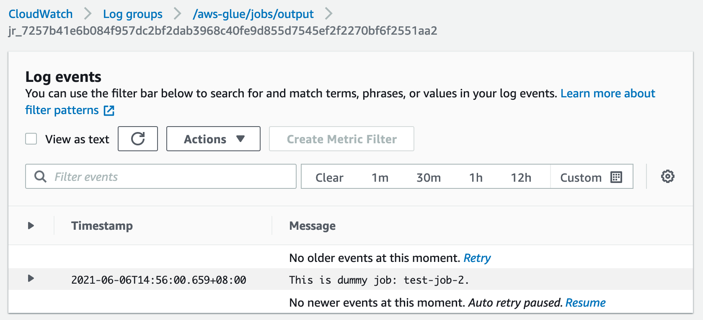

# Glue任务编排

AWS Glue是一项完全托管，无服务器架构的ETL服务。客户无需预置基础设置，仅需由Glue负责预置、扩展Spark运行环境，客户只需要专注开发ETL代码，并且使用AWS Glue时，只需为ETL作业运行时间付费。然而，当客户在考虑迁移现有ETL任务到Glue的过程中，Glue任务编排的选型上有诸多选择，例如：

- AWS原生编排服务Step Functions
- Glue原生的Glue Workflow
- 数据工程中流行的Apache Airflow

本文就编排选型，如何实现自动化迁移工作流，减少开发人员适配工作上做一定的探索。关于使用Step Functions管理Glue任务的资料相对丰富，可以参考官方文档：[使用AWS Step Functions管理Glue任务](https://docs.aws.amazon.com/step-functions/latest/dg/connect-glue.html)以及[诸多博客](https://aws.amazon.com/cn/blogs/big-data/category/application-services/aws-step-functions/)，本文不再重复，会重点介绍后两种编排方式，并且加以总结。

## 使用Glue Workflow编排任务

Glue原生提供Glue Workflow（Glue工作流）作为Glue ETL任务的编排服务。Glue Workflow提供可视化界面，可以方便地创建基于Glue任务的工作流，在Glue工作流中指定作业、爬虫程序（Glue Crawler)和触发器。工作流可以按需或者按指定计划运行。

然而，在迁移现有ETL工作流，尤其是复杂的ETL工作流时，在可视化界面上一一重新定义并不现实。这时候就需要有自动化手段进行迁移。和其他AWS服务类似，Glue Workflow的代码化定义有几种方式：

- Glue服务的API/SDK
- CloudFormation
- AWS CDK (Cloud Development Kit)

以常见的Azkaban工作流为例，Azkaban[可通过API导出现有工作流的JSON](https://azkaban.github.io/azkaban/docs/latest/#api-fetch-flows-of-a-project)描述文件，示例如下。

```json
[
  {
  "project" : "azkaban-test-project",
  "nodes" : [ {
    "id" : "test-final",
    "type" : "command",
    "in" : [ "test-job-3" ]
  }, {
    "id" : "test-job-start",
    "type" : "java"
  }, {
    "id" : "test-job-3",
    "type" : "java",
    "in" : [ "test-job-2" ]
  }, {
    "id" : "test-job-2",
    "type" : "java",
    "in" : [ "test-job-start" ]
  } ],
  "flow" : "sample-workflow-by-cdk",
  "projectId" : 192
  }
]
```

在上述JSON描述文件里，每个node是一个任务，而每个节点的依赖任务则定义在"in"中。针对这样的任务关联描述，我们选用AWS CDK的方式部署Glue Workflow，因为使用CDK可以用代码化的方式生成CloudFormation模板，而不需要在模板里手动填写每个任务的依赖关系，从而减少开发人员的工作量。并且，当修改JSON描述文件时，比如增加或者删除一个任务依赖时，只需要重新运行CDK deploy就可以更新CloudFormation堆栈，CloudFormation可以自动生成Changeset更新，将提交的更改与堆栈的当前状态进行对比，然后仅更新更改过的资源。

### 使用CDK部署Glue ETL任务和工作流

如果没有在客户端安装过CDK，可以参照[AWS CDK文档](https://docs.aws.amazon.com/cdk/latest/guide/getting_started.html)安装。

```bash
git clone https://github.com/yizhizoe/glue_orchestration.git
cd glue-workflow-cdk
#上传Python脚本到Glue的默认S3桶
aws s3 cp dummy.py s3://aws-glue-scripts-<account ID>-<region>/
export GLUE_SCRIPT_S3="s3://aws-glue-scripts-<account ID>-<region>/dummy.py"
cdk init
#部署Glue任务的定义
cdk deploy glue-job-cdk 
#部署Glue工作流的定义
cdk deploy glue-workflow-cdk
```

在CloudFormation Stack中我们能看到创建了两个堆栈

- glue-job-cdk部署了描述文件中所有的Glue ETL任务。由于示例代码仅关注任务之间的编排，每个任务都使用了一个最简单的Spark脚本，使用了Glue 2.0的引擎并且分配了5个DPU。
- glue-workflow-cdk部署了Glue工作流的定义，并且激活了工作流中的每一个触发器。



在Glue管理界面上，我们可以看到如下的工作流



尝试启动工作流，可以看到执行成功。



### 更新工作流

当开发人员在工作流需要添加一个任务test-job-4，并且更改任务之间依赖，他只需要在json文件里修改。


重新部署Glue任务和Glue工作流的CDK堆栈

```bash
cp updated_sample_workflow.json sample_workflow.json
cdk deploy glue-job-cdk
cdk deploy glue-workflow-cdk
```

在CloudFormation glue-workflow-cdk堆栈的Changes里，我们注意到在只有变化的部分被更新了。



在工作流界面上可以发现任务test-job-4已经被加到工作流里


虽然在我们的示例中只有几个任务的工作流，但是在实践中可以应用到更多更复杂的工作流的更新上。使用CDK的部署方式使得开发人员只需要维护比较简单的依赖描述文件，而不需要去反复实现工作流部署的代码。

在使用CDK部署工作流的同时，需要注意以下CloudFormation的[一些限制](https://docs.aws.amazon.com/AWSCloudFormation/latest/UserGuide/cloudformation-limits.html)

- CloudFormation单个Stack资源上限：由于任务的堆栈里每个工作流、任务、触发器都会对应一个资源，需要注意单个堆栈最多只能有500个资源。
- CloudFormation单个模板长度上限：如果工作流过长（几百个任务以上），可能会使得CDK生成的CloudFormation模板超过1MB的长度限制。

**(Glue workflow的好处和坏处@guojian)**

## 使用Apache Airflow编排任务

Apache Airflow 是近几年流行的一个分布式的通用任务编排平台，通过  DAG（Directed acyclic graph 有向无环图）来管理任务流程的任务调度工具，而DAG在Python代码中定义，设置任务的依赖关系即可实现任务调度。Airflow记录了已执行任务的状态，报告故障，必要时重试，并允许安排整个管道或其部分以通过回填来执行。

Airflow对很多AWS上的服务都有集成，提供了丰富的[operator](https://airflow.apache.org/docs/apache-airflow-providers-amazon/stable/_api/airflow/providers/amazon/aws/index.html)，相当于预先定义好的任务模板，[比如可以通过EC2StartInstanceOperator启动一台](https://airflow.apache.org/docs/apache-airflow-providers-amazon/stable/_api/airflow/providers/amazon/aws/operators/ec2_start_instance/index.html#module-airflow.providers.amazon.aws.operators.ec2_start_instance)AWS EC2机器。下文中我们会尝试使用Airflow来部署同样的工作流。

Airflow在AWS上有各种部署形态，可以基于[EKS](https://aws.amazon.com/cn/blogs/containers/running-airflow-workflow-jobs-on-amazon-eks-spot-nodes/)，[ECS Fargate](https://aws.amazon.com/cn/blogs/containers/running-airflow-on-aws-fargate/)。本文中我们使用AWS托管的Airflow服务，即MWAA（Amazon Managed Workflows for Apache Airflow)。MWAA提供了开箱即用的Airflow服务，不需要维护机器，可自动扩展，高可用，减少运维的工作，并且提供了和IAM的集成。

在这一节里，我们仅创建Airflow DAG做Glue任务的编排，Glue任务的定义我们沿用上一节CDK部署的Glue任务。

### 创建MWAA环境

1. 执行以下创建MWAA环境的s3桶。将Python依赖requirements.txt和DAG上传到s3里。

```bash
cd ../glue-airflow/
export MWAA_S3=s3://<new_bucket_name_for_mwaa_dag>
aws s3 mb $MWAA_S3
aws s3 cp requirements.txt $MWAA_S3/
aws s3 cp sample_workflow.json $MWAA_S3/
aws s3 cp dags/glue_dag.py $MWAA_S3/dags/
```

2. [按照MWAA Get Started文档创建MWAA环境](https://docs.aws.amazon.com/mwaa/latest/userguide/get-started.html)，注意以下MWAA环境使用的是最新Airflow 2.0以上的环境，在创建MWAA环境时，选择**Airflow 2.0.2**。

3. 给MWAA的执行角色添加Glue任务相应的权限。

```bash
POLICY_ARN=$(aws iam create-policy --policy-document file://iam_policy_example/glue-run-policy.json --policy-name glue-run-policy --query Policy.Arn)
aws iam attach-role-policy --role-name Glue-mwaa-env-role --policy-arn $POLICY_ARN
```

### Glue ETL任务DAG的实现

虽然Airflow提供了[AWS Glue Operator](https://airflow.apache.org/docs/apache-airflow-providers-amazon/stable/_api/airflow/providers/amazon/aws/operators/glue/index.html)，但目前这个Operator仅支持创建并执行Glue 1.0的任务。在示例代码中，我们用PythonOperator自定义了Glue的operator，底下实现使用AwsBaseHook启动Glue任务，轮询其状态，并且将任务的唯一标识ID记录在Airflow worker日志中。

```python
def get_glue_operator_args(job_name):
    glue_client = AwsBaseHook(aws_conn_id='aws_default').get_client_type(client_type='glue')
    response = glue_client.start_job_run(JobName=job_name)
    job_id = response['JobRunId']
    print("Job {} ID: {}".format(job_name,job_id))
    while True:
        status = glue_client.get_job_run(JobName=job_name, RunId=job_id)
        state = status['JobRun']['JobRunState']
        if state == 'SUCCEEDED':
            print('Glue job {} run ID {} succeeded'.format(job_name,job_id))
            break
        if state in ['STOPPED', 'FAILED', 'TIMEOUT', 'STOPPING']:
            print('Glue job {} run ID {} is in {} state'.format(job_name,job_id, state))
            raise Exception
        time.sleep(10)
```

### 在MWAA中执行Glue ETL任务的DAG

登录到Airflow的UI界面上可以看到sample-workflow-by-airflow的DAG。在启动它之前，我们先设置所需的两个Airflow变量。

- workflow_file_path：设置为工作流json文件的S3 URI
- max_capacity：这是Glue任务所需的资源容量，即DPU数量。此处我们设置为5。



回到DAG的界面，将sample_workflow_by_airflow DAG设置为active。在Graph view里可以看到这个DAG结构和json描述文件里的任务相对应。启动DAG可以看到DAG执行成功。



虽然每个DAG中的Task instance和Glue的任务一一对应，但是如果要查找Glue任务的执行日志以及监控指标，我们需要能关联每次执行的Task Instance和Glue任务的Run ID。



Task instance的日志里记录了Glue任务的Run ID。



根据这个Run ID，可以在Glue的CloudWatch Log Group里搜索日志流，就可以找到对应的日志。






### （比较和结论@guojian)

|     | Glue Workflow  |Airflow (MWAA)|
|  ----  | ----  |----- |
| 成本  | 低  @zoe| 中  @zoe|
|ETL功能|glue提供基本的调度功能。高级的监控功能可以通过EventBridge和CloudWatch来实现。|Airflow 有更丰富ETL相关功能。比如调度，Job SLA， Pool管理,hook等。|
| 开发难度  | 低～中等。小规模项目可以在线配置。job数量较多时候，可以使用CDK或者Boto33自动创建job.  |高，需要编写python代码生成dag。|
| 运维难度|低，无需关注HA,性能等问题。|中，基于AWS提供MWAA,可以大幅度降低Airflow的运维工作量。但使用人员仍关注airflow的性能和资源情况|
|支持大数据引擎 | 主要支持glue job .可以通过python shell调用其他数据|丰富的operator支持|
|可视化功能|可视化配置workflow。可以在页面上进行job调用，workflow重试功能|web页面提供丰富ETL相关展示，但无法可视化配置workflow.在job数量多时，展示更友好。|

GLue workflow和ariflow有各自的设计哲学和适用场景。如果你不知道如何选择，下面是一些建议：项目规模较小，团队开发能力偏弱，建议可以先尝试使用Glue Workflow。如果项目规模庞大，数据流程复杂度比较高,可以考虑使用
airflow作为glue调度工具
